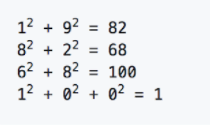
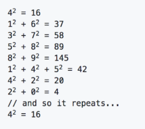

Happy Numbers
---

This code challenges is from _If Hemmingway Wrote JavaScript_ by Angus Croll

## Challenge

Write a function that determines if the supplied argument is a "happy number". Take any positive integer, add the squares of its digits, rinse, repeat. If you eventually reach 1, the original number is happy so return `true`; otherwise, it's inconsolable (unhappy) so return `false`

```js
function isHappy(n) {
```

> **You can assume valid input**

## Test Cases

**`19`** is happy because:



**`4`** is inconsolable (unhappy) because:



